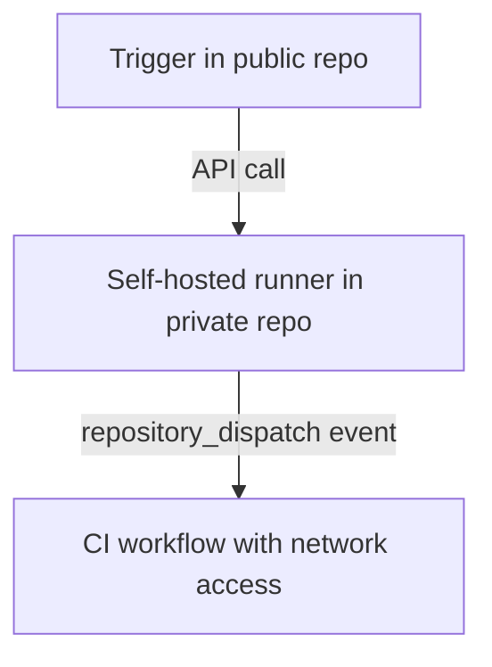

# GitHub Actions Runners

As certain CI workflows interact with resources in the private network, the CI tool GitHub Actions requires some more
specific adjustments than purely running the workflows on GitHub-hosted runners. Even though it is possible to provide
the GitHub-hosted runners access to the private network via a tunnel, I decided to run self-hosted runners for learning
purposes.

Assigning self-hosted runners is extremely risky for a number of reasons. After passing the PR hurdle of a public repo,
attackers could:

* Execute arbitrary workflows on machines within the private network
* Expose secrets and repo-unrelated details
* Access other machines in the private network
* Persist random code on private machines (e.g. malware or background processes)

Even though these attack vectors could be closed for specific action-triggering even types, I assess the security
barrier as too low and the chance of omitting some details as too high to use self-hosted runners in a public repo. The
used self-hosted runners are therefore hosted in the private repo `gohfert-cluster-private-runners` and triggered via a
dispatch event.

Learn in [the relevant guide](../guides/deploy-private-gha-runners.md) on how to provision a private GitHub Actions
runner for this cluster.
