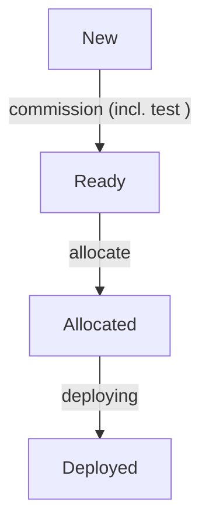

# Typical MAAS Provisioning Flow

1. Commissioning the server is MAAS discovering and inspecting the new or released machine after it PXE-boots.
2. Allocating the server assigns it to the user so that other MAAS users do not maddle with the machine.
3. Deploying the server is the process of actually installing an OS on the server's disks.

A machine assumes [different states](https://canonical.com/maas/docs/about-the-machine-life-cycle) according the the
performed steps. The flow description assumes clicking through the web GUI of the MAAS instance.

During the whole provisioning flow, servers are a few times shut down. As thin clients power is not externally managed,
you have to start the server manually when it gets shut down. This can be seen on a server's power LED the network
switch's LED.

## Web UI

If a new machine is connected a subnet monitored by MAAS, the machine shows up in the web UI. Via the `Actions` tab, you
can then go intuitively through the aforementioned provisioning flow.
